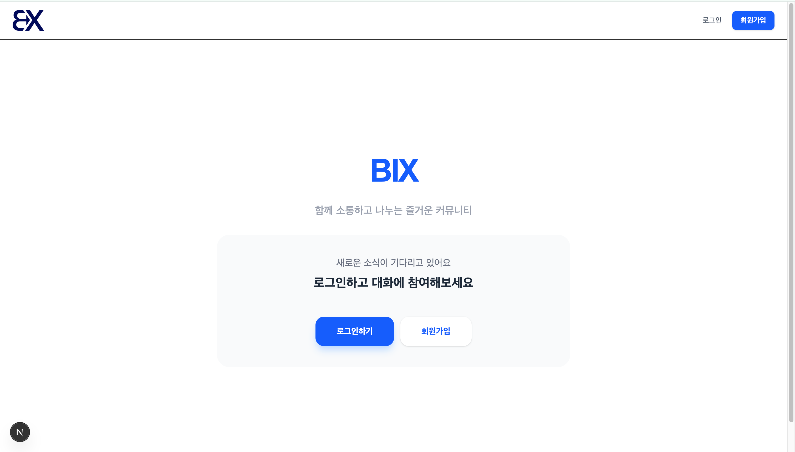

# 🪧 커뮤니티 게시판 프로젝트 (Community Board)

사용자들이 자유롭게 글을 작성하고 소통할 수 있는 **Next.js 기반의 웹 커뮤니티 서비스**입니다. 기본 CRUD 기능뿐만 아니라 사용자 경험을 고려한 실시간 검색 및 가독성 최적화 UI를 구현하였습니다.

---

## 🛠 기술 스택 (Tech Stack)

* **Framework**: Next.js 16.1.6 (App Router)
* **Language**: TypeScript
* **State Management**: Zustand (Auth Store)
* **Styling**: Tailwind CSS
* **HTTP Client**: Axios
* **Build Tool**: Turbopack

---

## ✨ 핵심 구현 기능 (Core Features)

### 1. 사용자 인증 및 정보 표시 (Auth)
* **JWT 기반 인증**: 회원가입 및 로그인 기능을 구현하고, 발급받은 `AccessToken`을 통해 보안 통신을 처리합니다.
* **사용자 정보 상단 표시**: 로그인한 사용자의 **아이디(이메일)와 이름**이 헤더 영역에 노출되도록 구현하였습니다.
* **로그인 유지**: `localStorage`와 Zustand를 활용하여 새로고침 시에도 사용자 세션이 유지되도록 관리합니다.

### 2. 게시판 목록 및 카테고리 (Board List)
* **카테고리별 테마 적용**: `NOTICE`(Rose), `FREE`(Blue), `QNA`(Emerald), `ETC`(Amber) 등 카테고리별 고유 색상을 부여하여 가독성을 높였습니다.
* **페이지네이션**: 서버 API 명세에 맞춘 페이지 네비게이션으로 대량의 데이터를 효율적으로 조회합니다.
* **서버/클라이언트 필터링**: 카테고리 탭 선택 시 해당하는 게시글만 노출되도록 필터링 로직을 구성하였습니다.

### 3. 게시글 CRUD 및 이미지 처리 (Post Management)
* **전체 CRUD 구현**: 게시글의 등록, 상세 조회, 수정, 삭제 기능을 모두 포함합니다.
* **이미지 렌더링 최적화**: 첨부 이미지 유효성 검사 및 서버 경로 정규화를 통해 잘못된 이미지 박스가 노출되는 현상을 방지하였습니다.
* **권한 분기**: 작성자 본인에게만 수정 및 삭제 버튼이 보이도록 로직을 구성하여 보안을 강화했습니다.

---

## 💡 차별화된 추가 구현 내용 (Extra Features)

* **🔍 실시간 검색 (Client-side Search)**: 별도의 API 호출 없이 현재 페이지 내 게시글을 제목/작성자 기준으로 실시간 필터링합니다. `useMemo`를 통해 성능 저하 없는 즉각적인 피드백을 제공합니다.
* **🎨 가독성 최적화 (Readability Enhancement)**: 텍스트 크기와 행 간격을 확장하고, 라운딩 처리가 강조된 최신 UI 트렌드를 반영하여 시각적 답답함을 해소하였습니다.
* **⌛ 로딩 잔상 방지**: 데이터가 로드되기 전 이전 게시글의 내용이 잠깐 보이는 현상을 `isLoading` 상태값으로 엄격히 제어하여 깔끔한 화면 전환을 구현했습니다.

---

## 📂 프로젝트 구조 (Project Structure)

```text
src/
├── api/
│   └── axios.ts              # Axios 인스턴스 (인증 헤더 설정)
├── app/
│   ├── board/
│   │   ├── [id]/
│   │   │   ├── edit/
│   │   │   │   └── page.tsx  # 게시글 수정 페이지
│   │   │   └── page.tsx      # 게시글 상세 조회 페이지
│   │   ├── write/
│   │   │   └── page.tsx      # 게시글 작성 페이지
│   │   └── page.tsx          # 게시글 목록 및 실시간 검색
│   ├── login/
│   │   └── page.tsx          # 로그인 페이지
│   ├── signup/
│   │   └── page.tsx          # 회원가입 페이지
│   ├── globals.css           # 글로벌 스타일 설정
│   ├── layout.tsx            # 공통 레이아웃
│   └── page.tsx              # 메인 홈 페이지
├── components/
│   └── Navbar.tsx            # 공통 네비게이션 바 컴포넌트
└── store/
    └── useAuthStore.ts       # Zustand (사용자 인증 상태 관리)
```
---

## ⚙️ 실행 방법 (Installation)

### 1. 저장소 복제 및 폴더 이동
```bash
git clone [https://github.com/sjwjwu/community-board.git](https://github.com/sjwjwu/community-board.git)
cd community-board
```

### 2. 의존성 설치
```bash
npm install
```

### 3. 환경 변수 설정
```bash
# .env.local
NEXT_PUBLIC_API_URL=[https://front-mission.bigs.or.kr](https://front-mission.bigs.or.kr)
```

### 4. 개발 서버 실행
```bash
npm run dev
```

---    

## 예시



---
